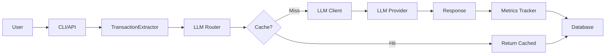

# AI Engineering Learning Guide: Gmail CLI Expense Agent

A comprehensive guide to understanding the AI engineering concepts in your project and how to extend it for deeper learning.

---

## 📋 Table of Contents

1. [Project Overview](#project-overview)
2. [Core AI Engineering Concepts](#core-ai-engineering-concepts)
3. [Architecture Deep Dive](#architecture-deep-dive)
4. [Learning Path](#learning-path)
5. [Extension Ideas](#extension-ideas)
6. [End-to-End AI Engineering Project](#end-to-end-ai-engineering-project)

---

## 🎯 Project Overview

### What You've Built

Your **FinCLI** project is a production-ready AI application that:
- Connects to Gmail via OAuth2
- Uses LLMs to extract financial transactions from emails
- Provides CLI and REST API interfaces
- Implements cost optimization through caching
- Tracks observability metrics
- Manages prompts as versioned YAML files

**Current Status:** ✅ 106/106 tests passing, production-ready

---

## 🧠 Core AI Engineering Concepts

### 1. **Multi-Provider LLM Architecture**

**What it is:** Your project supports 4 different LLM providers (Ollama, Anthropic, OpenAI, AWS Bedrock) through a unified interface.

**Key Files:**
- [`fincli/clients/base_llm_client.py`](file:///Users/rishavsaraf/Desktop/touch/Development/AI_Agents/gmail-cli-expense-agent/fincli/clients/base_llm_client.py) - Abstract base class
- [`fincli/clients/llm_factory.py`](file:///Users/rishavsaraf/Desktop/touch/Development/AI_Agents/gmail-cli-expense-agent/fincli/clients/llm_factory.py) - Factory pattern for client creation
- [`fincli/clients/llm_router.py`](file:///Users/rishavsaraf/Desktop/touch/Development/AI_Agents/gmail-cli-expense-agent/fincli/clients/llm_router.py) - Use-case based routing

**Why it matters:**
- **Flexibility:** Switch providers without changing business logic
- **Cost optimization:** Use free Ollama for dev, paid APIs for production
- **Resilience:** Fallback to different providers if one fails

**Design Pattern:** **Strategy Pattern** + **Factory Pattern**

```python
# Strategy Pattern: Different implementations of same interface
class BaseLLMClient(ABC):
    @abstractmethod
    def generate_text(self, prompt: str) -> str:
        pass

# Factory Pattern: Create clients based on configuration
def create_llm_client(provider: str) -> BaseLLMClient:
    if provider == "ollama":
        return OllamaClient()
    elif provider == "anthropic":
        return AnthropicClient()
    # ...
```

---

### 2. **LLM Response Caching**

**What it is:** Caches LLM responses to avoid redundant API calls, reducing costs by 30-90%.

**Key Files:**
- [`fincli/cache/llm_cache.py`](file:///Users/rishavsaraf/Desktop/touch/Development/AI_Agents/gmail-cli-expense-agent/fincli/cache/llm_cache.py) - Core caching logic
- [`fincli/cache/cache_manager.py`](file:///Users/rishavsaraf/Desktop/touch/Development/AI_Agents/gmail-cli-expense-agent/fincli/cache/cache_manager.py) - Cache management

**Implementation Details:**
- **Cache Key:** Hash of (prompt + model + parameters)
- **Eviction Policy:** LRU (Least Recently Used) + TTL (Time To Live)
- **Persistence:** Optional disk storage across restarts

**Why it matters:**
- **Cost savings:** Avoid paying for duplicate requests
- **Speed:** Instant responses for cached queries
- **Development:** Fast iteration without API costs

**Design Pattern:** **Decorator Pattern** + **Singleton Pattern**

```python
# Decorator wraps LLM calls with caching
@cache_decorator
def generate_text(self, prompt: str) -> str:
    # Cache checks before making API call
    cache_key = hash(prompt + model + params)
    if cached := cache.get(cache_key):
        return cached
    
    result = actual_llm_call(prompt)
    cache.set(cache_key, result, ttl=3600)
    return result
```

---

### 3. **Observability & Metrics Tracking**

**What it is:** Comprehensive tracking of LLM usage, costs, latency, and success rates.

**Key Files:**
- [`fincli/observability/llm_tracker.py`](file:///Users/rishavsaraf/Desktop/touch/Development/AI_Agents/gmail-cli-expense-agent/fincli/observability/llm_tracker.py) - Metrics collection

**Metrics Tracked:**
- **Token usage:** Input/output tokens per call
- **Cost:** Calculated using provider-specific pricing
- **Latency:** p50, p95, p99, mean, max
- **Success rate:** Percentage of successful calls
- **Cache performance:** Hit rate, cost savings

**Why it matters:**
- **Cost control:** Know exactly what you're spending
- **Performance monitoring:** Identify slow operations
- **Debugging:** Track failures and patterns
- **Optimization:** Data-driven decisions

**Storage:** JSON Lines format (`fincli_metrics.jsonl`)

```json
{
  "timestamp": "2024-11-19T10:30:45",
  "provider": "anthropic",
  "model": "claude-3-5-sonnet",
  "use_case": "extraction",
  "input_tokens": 850,
  "output_tokens": 120,
  "latency_ms": 1234.56,
  "cost_usd": 0.0039,
  "success": true
}
```

---

### 4. **Prompt Management & Versioning**

**What it is:** Prompts stored as YAML files, separate from code, with version control.

**Key Files:**
- [`fincli/prompts/`](file:///Users/rishavsaraf/Desktop/touch/Development/AI_Agents/gmail-cli-expense-agent/fincli/prompts/) - Prompt directory
- Prompt manager for loading/rendering prompts

**Structure:**
```yaml
name: transaction_extraction
version: v2
description: Enhanced extraction with edge cases

system_prompt: |
  You are an expert financial transaction extractor...

user_template: |
  Extract transaction from: $email_content

parameters:
  temperature: 0.0
  max_tokens: 600

metadata:
  created_date: "2024-11-19"
  performance_metrics:
    accuracy: 0.97
```

**Why it matters:**
- **A/B testing:** Compare different prompt versions
- **Iteration:** Update prompts without code changes
- **Tracking:** Know which prompts perform best
- **Rollback:** Revert to previous versions easily

**Design Pattern:** **Template Method Pattern**

---

### 5. **Use-Case Based LLM Routing**

**What it is:** Different LLM providers for different tasks (extraction vs chat vs analysis).

**Implementation:**
```python
class LLMUseCase:
    EXTRACTION = "extraction"  # Use Claude (best accuracy)
    CHAT = "chat"              # Use GPT-4 (best conversation)
    SUMMARY = "summary"        # Use Ollama (free, good enough)
    ANALYSIS = "analysis"      # Use Ollama
```

**Configuration:**
```bash
# .env
FINCLI_LLM_PROVIDER=ollama                    # Default
FINCLI_LLM_EXTRACTION_PROVIDER=anthropic      # Override for extraction
FINCLI_LLM_CHAT_PROVIDER=openai              # Override for chat
```

**Why it matters:**
- **Cost optimization:** Use expensive models only where needed
- **Quality:** Best model for each task
- **Flexibility:** Easy to experiment

---

### 6. **Structured Output Extraction**

**What it is:** Converting unstructured email text into structured JSON using LLMs.

**Key Files:**
- [`fincli/extractors/transaction_extractor.py`](file:///Users/rishavsaraf/Desktop/touch/Development/AI_Agents/gmail-cli-expense-agent/fincli/extractors/transaction_extractor.py)

**Process:**
1. **Input:** Raw email text
2. **LLM Processing:** Extract structured data
3. **Validation:** Check required fields
4. **Cleaning:** Normalize data (dates, amounts)
5. **Output:** `ExtractedTransaction` object

**Example:**
```
Input Email:
"Your card ending in 1234 was debited ₹500 at Starbucks on 15-Nov-2024"

↓ LLM Extraction ↓

Output JSON:
{
  "amount": 500.0,
  "transaction_type": "debit",
  "merchant": "Starbucks",
  "transaction_date": "2024-11-15",
  "currency": "INR"
}
```

**Challenges Handled:**
- Date parsing (multiple formats)
- Currency normalization
- Merchant name variations
- Missing data handling

---

### 7. **Configuration Management**

**What it is:** Type-safe, validated configuration using Pydantic.

**Key Files:**
- [`fincli/config.py`](file:///Users/rishavsaraf/Desktop/touch/Development/AI_Agents/gmail-cli-expense-agent/fincli/config.py)

**Features:**
- **Environment variables:** Load from `.env`
- **Type validation:** Pydantic ensures correct types
- **Default values:** Sensible defaults
- **Validation:** Custom validators for complex logic

```python
class Settings(BaseSettings):
    llm_provider: str = Field(default="ollama")
    cache_enabled: bool = Field(default=True)
    cache_ttl_seconds: int = Field(default=3600)
    
    @field_validator('llm_provider')
    def validate_provider(cls, v):
        valid = ['ollama', 'anthropic', 'openai', 'bedrock']
        if v not in valid:
            raise ValueError(f"Invalid provider: {v}")
        return v
```

---

## 🏗️ Architecture Deep Dive

### Layered Architecture

```
┌─────────────────────────────────────┐
│  Presentation Layer                 │  CLI (Typer) + REST API (FastAPI)
├─────────────────────────────────────┤
│  Business Logic Layer               │  TransactionExtractor, Analytics
├─────────────────────────────────────┤
│  AI/ML Layer                        │  LLM Router, Prompt Manager
├─────────────────────────────────────┤
│  Cross-Cutting Concerns             │  Caching, Observability, Logging
├─────────────────────────────────────┤
│  Infrastructure Layer               │  Database, Gmail Client, LLM Clients
└─────────────────────────────────────┘
```

### Data Flow



### Key Design Patterns Used

1. **Factory Pattern:** `llm_factory.py` - Create LLM clients
2. **Strategy Pattern:** `base_llm_client.py` - Interchangeable LLM implementations
3. **Singleton Pattern:** Global instances (router, tracker, cache)
4. **Decorator Pattern:** Caching wrapper around LLM calls
5. **Template Method:** Prompt rendering with variables
6. **Repository Pattern:** Database access abstraction

---

## 📚 Learning Path

### Phase 1: Understanding Current Implementation (1-2 weeks)

#### Week 1: Core Concepts

**Day 1-2: LLM Client Architecture**
- [ ] Read [`base_llm_client.py`](file:///Users/rishavsaraf/Desktop/touch/Development/AI_Agents/gmail-cli-expense-agent/fincli/clients/base_llm_client.py)
- [ ] Study one implementation (e.g., [`ollama_client.py`](file:///Users/rishavsaraf/Desktop/touch/Development/AI_Agents/gmail-cli-expense-agent/fincli/clients/ollama_client.py))
- [ ] Understand the Strategy pattern
- [ ] **Exercise:** Add a new method to `BaseLLMClient`

**Day 3-4: LLM Router & Use Cases**
- [ ] Read [`llm_router.py`](file:///Users/rishavsaraf/Desktop/touch/Development/AI_Agents/gmail-cli-expense-agent/fincli/clients/llm_router.py)
- [ ] Understand use-case routing logic
- [ ] Test different routing configurations
- [ ] **Exercise:** Add a new use case (e.g., `CATEGORIZATION`)

**Day 5-7: Transaction Extraction**
- [ ] Read [`transaction_extractor.py`](file:///Users/rishavsaraf/Desktop/touch/Development/AI_Agents/gmail-cli-expense-agent/fincli/extractors/transaction_extractor.py)
- [ ] Understand prompt construction
- [ ] Study validation and cleaning logic
- [ ] **Exercise:** Add a new field to extract (e.g., `category`)

#### Week 2: Advanced Features

**Day 1-2: Caching System**
- [ ] Read [`llm_cache.py`](file:///Users/rishavsaraf/Desktop/touch/Development/AI_Agents/gmail-cli-expense-agent/fincli/cache/llm_cache.py)
- [ ] Understand cache key generation
- [ ] Study LRU + TTL eviction
- [ ] **Exercise:** Implement cache statistics dashboard

**Day 3-4: Observability**
- [ ] Read [`llm_tracker.py`](file:///Users/rishavsaraf/Desktop/touch/Development/AI_Agents/gmail-cli-expense-agent/fincli/observability/llm_tracker.py)
- [ ] Understand metrics collection
- [ ] Study cost calculation
- [ ] **Exercise:** Add new metrics (e.g., error types)

**Day 5-7: Prompt Management**
- [ ] Study YAML prompt files
- [ ] Understand prompt versioning
- [ ] Test A/B testing workflow
- [ ] **Exercise:** Create a new prompt for a new use case

---

### Phase 2: Extending the Project (2-3 weeks)

#### Extension 1: Add New Data Extraction

**Goal:** Extract additional fields from emails

**Tasks:**
1. Add new fields to `ExtractedTransaction`:
   - `category` (e.g., "Food", "Transport", "Shopping")
   - `payment_method` (e.g., "Credit Card", "UPI")
   - `account_last_4` (last 4 digits of card/account)

2. Update prompts to extract new fields
3. Update database schema
4. Add validation for new fields
5. Update tests

**Learning Outcomes:**
- Schema evolution
- Prompt engineering
- Database migrations
- Test-driven development

---

#### Extension 2: Implement Smart Categorization

**Goal:** Automatically categorize transactions using LLM

**Tasks:**
1. Create `CategoryExtractor` class
2. Define category taxonomy (Food, Transport, Shopping, etc.)
3. Create categorization prompt
4. Implement category validation
5. Add category-based analytics

**Learning Outcomes:**
- Classification tasks with LLMs
- Taxonomy design
- Prompt engineering for classification
- Analytics implementation

**Example Implementation:**
```python
class CategoryExtractor:
    CATEGORIES = [
        "Food & Dining",
        "Transportation",
        "Shopping",
        "Bills & Utilities",
        "Entertainment",
        "Healthcare",
        "Other"
    ]
    
    def categorize(self, transaction: ExtractedTransaction) -> str:
        prompt = f"""
        Categorize this transaction:
        Merchant: {transaction.merchant}
        Amount: {transaction.amount}
        
        Categories: {', '.join(self.CATEGORIES)}
        
        Return only the category name.
        """
        return self.llm_client.generate_text(prompt)
```

---

#### Extension 3: Add Receipt OCR

**Goal:** Extract data from receipt images

**Tasks:**
1. Add image processing capability
2. Integrate OCR (e.g., Google Vision API, Tesseract)
3. Create receipt-specific extractor
4. Handle itemized data
5. Store receipt images

**Learning Outcomes:**
- Multimodal AI (text + images)
- OCR integration
- Structured data from semi-structured input
- File storage management

**Technologies:**
- Google Vision API
- Tesseract OCR
- PIL/Pillow for image processing

---

#### Extension 4: Build Spending Insights Dashboard

**Goal:** Create interactive analytics dashboard

**Tasks:**
1. Implement advanced analytics:
   - Spending trends over time
   - Category breakdown
   - Merchant frequency
   - Budget tracking
   - Anomaly detection

2. Create visualization endpoints
3. Build simple web dashboard (optional)

**Learning Outcomes:**
- Data analytics
- Visualization
- API design
- Frontend integration (if building UI)

**Example Analytics:**
```python
class SpendingAnalytics:
    def get_monthly_trend(self, months: int = 6):
        """Get spending trend for last N months"""
        
    def detect_anomalies(self, threshold: float = 2.0):
        """Detect unusual spending patterns"""
        
    def predict_next_month(self):
        """Predict next month's spending using simple ML"""
```

---

#### Extension 5: Implement Budget Alerts

**Goal:** Alert users when spending exceeds budget

**Tasks:**
1. Create budget configuration
2. Implement budget tracking
3. Add alert system (email/SMS)
4. Create budget analytics
5. Add budget recommendations using LLM

**Learning Outcomes:**
- Event-driven architecture
- Notification systems
- LLM for recommendations
- User preference management

---

#### Extension 6: Add Conversational Interface

**Goal:** Natural language queries about spending

**Tasks:**
1. Implement RAG (Retrieval Augmented Generation)
2. Create vector embeddings of transactions
3. Build semantic search
4. Implement conversational memory
5. Add follow-up question handling

**Learning Outcomes:**
- RAG architecture
- Vector databases (ChromaDB, Pinecone)
- Embeddings
- Conversational AI
- Context management

**Example:**
```
User: "How much did I spend on food last month?"
AI: "You spent ₹12,450 on food last month across 23 transactions."

User: "Which restaurant did I visit most?"
AI: "You visited Starbucks 8 times, spending ₹3,200 total."

User: "Can I afford a ₹5000 dinner this weekend?"
AI: "Based on your budget of ₹15,000/month for food and current 
     spending of ₹12,450, you have ₹2,550 remaining. A ₹5,000 
     dinner would exceed your budget by ₹2,450."
```

---

### Phase 3: Production Engineering (2-3 weeks)

#### Production Feature 1: Deployment

**Tasks:**
1. Containerize with Docker
2. Set up CI/CD (GitHub Actions)
3. Deploy to cloud (AWS/GCP/Azure)
4. Set up monitoring (Prometheus/Grafana)
5. Implement health checks

**Learning Outcomes:**
- Docker & containerization
- CI/CD pipelines
- Cloud deployment
- Monitoring & alerting

---

#### Production Feature 2: Scalability

**Tasks:**
1. Add async processing (Celery/RQ)
2. Implement job queues
3. Add rate limiting
4. Optimize database queries
5. Implement connection pooling

**Learning Outcomes:**
- Async programming
- Task queues
- Performance optimization
- Database optimization

---

#### Production Feature 3: Security

**Tasks:**
1. Implement API authentication (JWT)
2. Add rate limiting
3. Encrypt sensitive data
4. Implement audit logging
5. Add RBAC (Role-Based Access Control)

**Learning Outcomes:**
- Security best practices
- Authentication & authorization
- Encryption
- Compliance (GDPR, etc.)

---

## 🚀 End-to-End AI Engineering Project

### Project: Multi-User Expense Management Platform

**Goal:** Transform your CLI tool into a production SaaS platform

### Architecture

```
┌─────────────────────────────────────────────────────────┐
│                    Frontend Layer                        │
│  React/Next.js Dashboard + Mobile App (React Native)    │
└─────────────────────────────────────────────────────────┘
                            ↓
┌─────────────────────────────────────────────────────────┐
│                     API Gateway                          │
│  FastAPI + Authentication + Rate Limiting               │
└─────────────────────────────────────────────────────────┘
                            ↓
┌─────────────────────────────────────────────────────────┐
│                  Business Logic Layer                    │
│  Transaction Processing + Analytics + AI Services       │
└─────────────────────────────────────────────────────────┘
                            ↓
┌───────────────┬─────────────────┬──────────────────────┐
│  AI Services  │  Data Layer     │  External Services   │
│  - LLM Router │  - PostgreSQL   │  - Gmail API         │
│  - Embeddings │  - Redis Cache  │  - Twilio (SMS)      │
│  - RAG        │  - Vector DB    │  - SendGrid (Email)  │
└───────────────┴─────────────────┴──────────────────────┘
```

### Features to Implement

#### Phase 1: Multi-User Support (Week 1-2)
- [ ] User authentication (JWT)
- [ ] User registration & login
- [ ] Multi-tenant database design
- [ ] User-specific Gmail connections
- [ ] User preferences & settings

#### Phase 2: Advanced AI Features (Week 3-4)
- [ ] Smart categorization with learning
- [ ] Spending predictions (ML models)
- [ ] Anomaly detection
- [ ] Budget recommendations
- [ ] Receipt OCR
- [ ] Conversational AI with RAG

#### Phase 3: Analytics & Insights (Week 5-6)
- [ ] Interactive dashboards
- [ ] Custom reports
- [ ] Export functionality (PDF, CSV)
- [ ] Spending trends
- [ ] Comparative analytics
- [ ] Budget vs actual tracking

#### Phase 4: Collaboration Features (Week 7-8)
- [ ] Shared budgets (families/teams)
- [ ] Expense splitting
- [ ] Approval workflows
- [ ] Comments & notes
- [ ] Notifications

#### Phase 5: Production Ready (Week 9-10)
- [ ] Docker deployment
- [ ] CI/CD pipeline
- [ ] Monitoring & logging
- [ ] Error tracking (Sentry)
- [ ] Performance optimization
- [ ] Security hardening
- [ ] Documentation
- [ ] Load testing

#### Phase 6: Mobile App (Week 11-12)
- [ ] React Native app
- [ ] Camera for receipt scanning
- [ ] Push notifications
- [ ] Offline support
- [ ] Biometric authentication

---

## 🎓 Learning Resources

### AI Engineering

1. **LLM Fundamentals**
   - [Anthropic's Prompt Engineering Guide](https://docs.anthropic.com/claude/docs/prompt-engineering)
   - [OpenAI's Best Practices](https://platform.openai.com/docs/guides/prompt-engineering)

2. **RAG & Embeddings**
   - [LangChain Documentation](https://python.langchain.com/)
   - [Pinecone Learning Center](https://www.pinecone.io/learn/)

3. **Production AI**
   - [Full Stack Deep Learning](https://fullstackdeeplearning.com/)
   - [Made With ML](https://madewithml.com/)

### Software Engineering

1. **Design Patterns**
   - "Design Patterns: Elements of Reusable Object-Oriented Software"
   - [Refactoring Guru](https://refactoring.guru/design-patterns)

2. **System Design**
   - [System Design Primer](https://github.com/donnemartin/system-design-primer)
   - "Designing Data-Intensive Applications" by Martin Kleppmann

3. **Testing**
   - "Test-Driven Development" by Kent Beck
   - [Pytest Documentation](https://docs.pytest.org/)

### DevOps & Production

1. **Docker & Kubernetes**
   - [Docker Documentation](https://docs.docker.com/)
   - [Kubernetes Basics](https://kubernetes.io/docs/tutorials/kubernetes-basics/)

2. **Monitoring**
   - [Prometheus & Grafana Tutorial](https://prometheus.io/docs/introduction/overview/)
   - [OpenTelemetry](https://opentelemetry.io/)

---

## 🎯 Career Transition Tips

### Building Your Portfolio

1. **Document Everything**
   - Write detailed README files
   - Create architecture diagrams
   - Document design decisions
   - Write blog posts about your learnings

2. **Open Source Contributions**
   - Contribute to LLM libraries (LangChain, LlamaIndex)
   - Fix bugs in popular projects
   - Create useful tools/libraries

3. **Build in Public**
   - Share progress on Twitter/LinkedIn
   - Write technical blog posts
   - Create YouTube tutorials
   - Present at meetups

### Skills to Highlight

**AI Engineering:**
- LLM integration & prompt engineering
- RAG implementation
- Vector databases
- Model evaluation & monitoring
- Cost optimization

**Software Engineering:**
- Clean architecture
- Design patterns
- Testing (unit, integration, e2e)
- API design
- Database design

**DevOps:**
- Docker & containerization
- CI/CD pipelines
- Cloud deployment (AWS/GCP)
- Monitoring & observability
- Performance optimization

### Interview Preparation

1. **System Design**
   - Design an AI-powered recommendation system
   - Design a scalable LLM application
   - Design a real-time analytics platform

2. **Coding**
   - LeetCode (Medium/Hard)
   - Design patterns implementation
   - Async programming

3. **AI-Specific**
   - Prompt engineering techniques
   - RAG architecture
   - LLM evaluation metrics
   - Cost optimization strategies

---

## 📊 Success Metrics

Track your learning progress:

- [ ] Understand all core concepts in current project
- [ ] Implement at least 3 extensions
- [ ] Deploy to production
- [ ] Write 5+ technical blog posts
- [ ] Contribute to 2+ open source projects
- [ ] Build complete end-to-end project
- [ ] Get 100+ GitHub stars on your project
- [ ] Present at a meetup/conference

---

## 🤝 Next Steps

1. **This Week:**
   - Read through this guide completely
   - Set up a learning schedule
   - Choose your first extension project
   - Join AI engineering communities (Discord, Reddit)

2. **This Month:**
   - Complete Phase 1 of learning path
   - Implement first extension
   - Write first blog post
   - Start building portfolio

3. **Next 3 Months:**
   - Complete all phases
   - Build end-to-end project
   - Apply for AI engineering roles
   - Network with AI engineers

---

## 📞 Community & Support

- **Discord:** Join AI engineering communities
- **Twitter:** Follow AI engineering leaders
- **GitHub:** Star and watch relevant projects
- **LinkedIn:** Connect with AI engineers
- **Meetups:** Attend local AI/ML meetups

---

**Remember:** The best way to learn is by building. Start small, iterate fast, and don't be afraid to make mistakes. Your current project is already impressive—now it's time to take it to the next level!

Good luck on your AI engineering journey! 🚀
