# Visual Architecture Guide: FinCLI

Visual diagrams and concept maps to understand the system architecture and AI engineering concepts.

---

## 🏗️ System Architecture

### High-Level Architecture

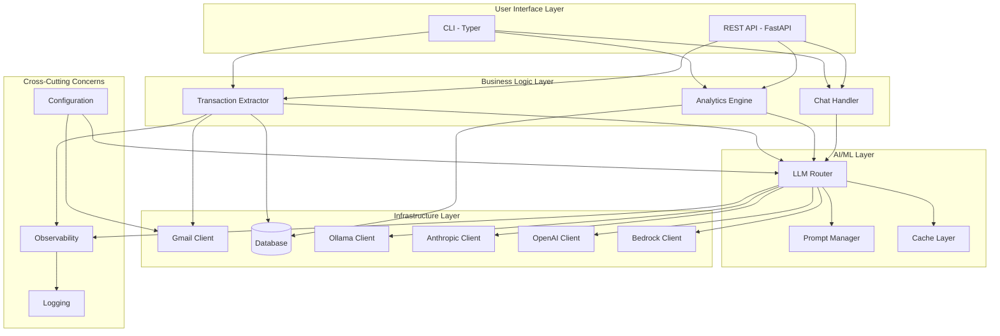

---

## 🔄 Data Flow Diagram

### Transaction Extraction Flow

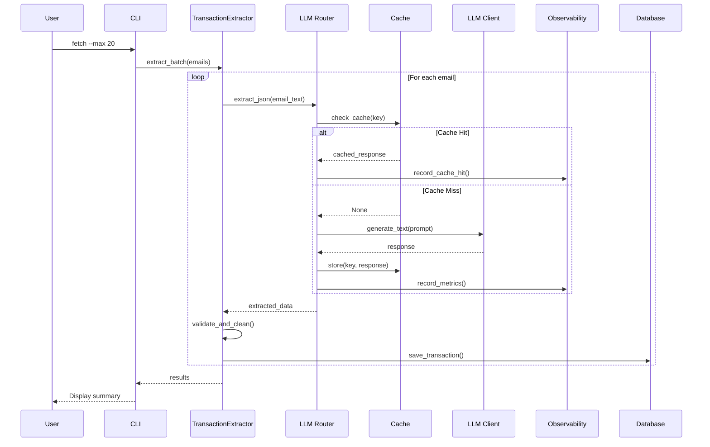

---

## 🧩 Component Relationships

### LLM Client Architecture

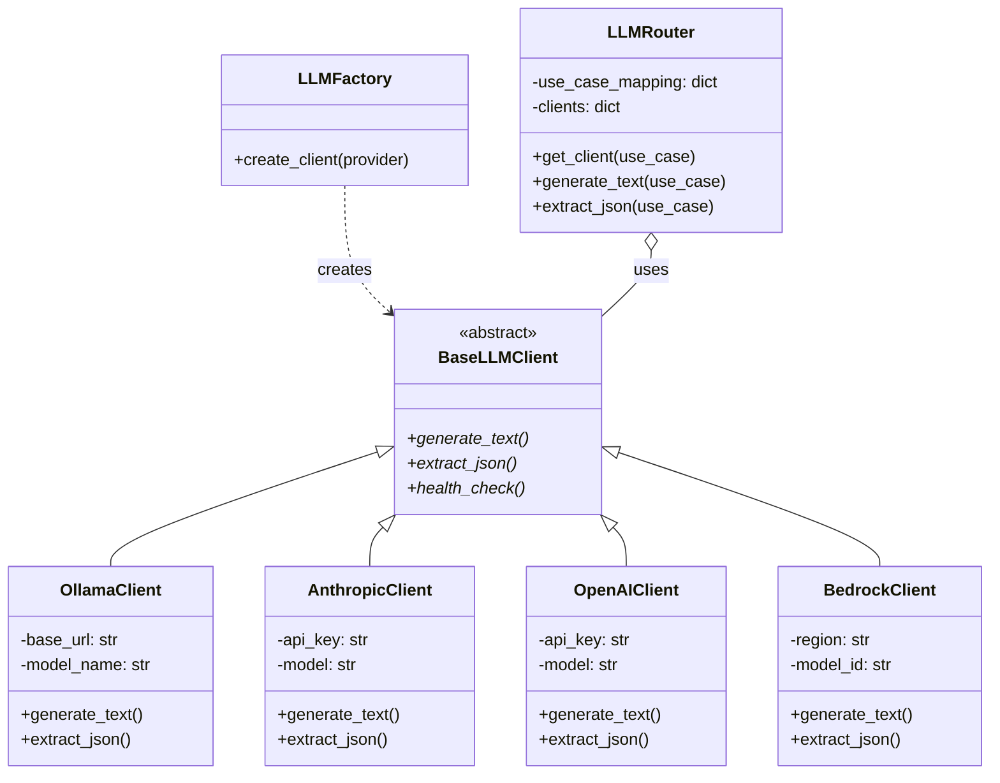

---

## 🎯 AI Engineering Concepts Map

### Core Concepts and Their Relationships

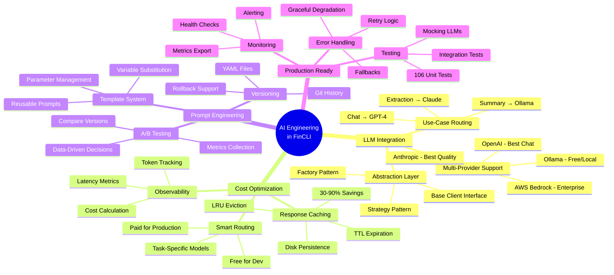

---

## 📊 Caching Architecture

### Cache Flow and Eviction

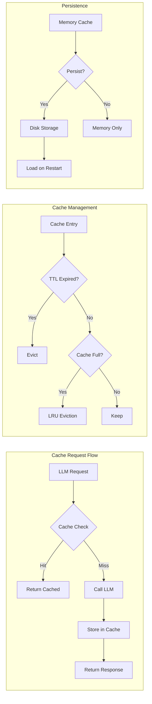

---

## 🎨 Design Patterns Used

### Pattern Catalog

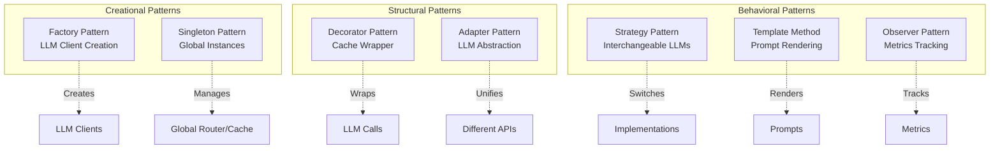

---

## 🔍 Observability Architecture

### Metrics Collection Flow

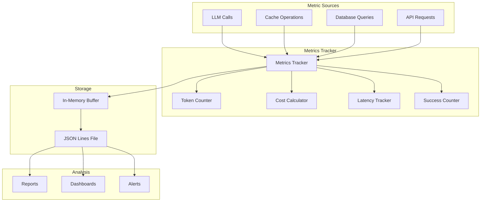

---

## 🗄️ Database Schema

### Entity Relationship Diagram

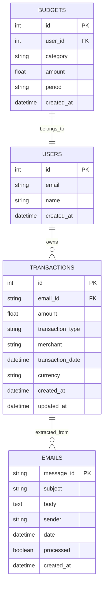

---

## 🔐 Authentication Flow (Future Extension)

### OAuth2 + JWT Flow

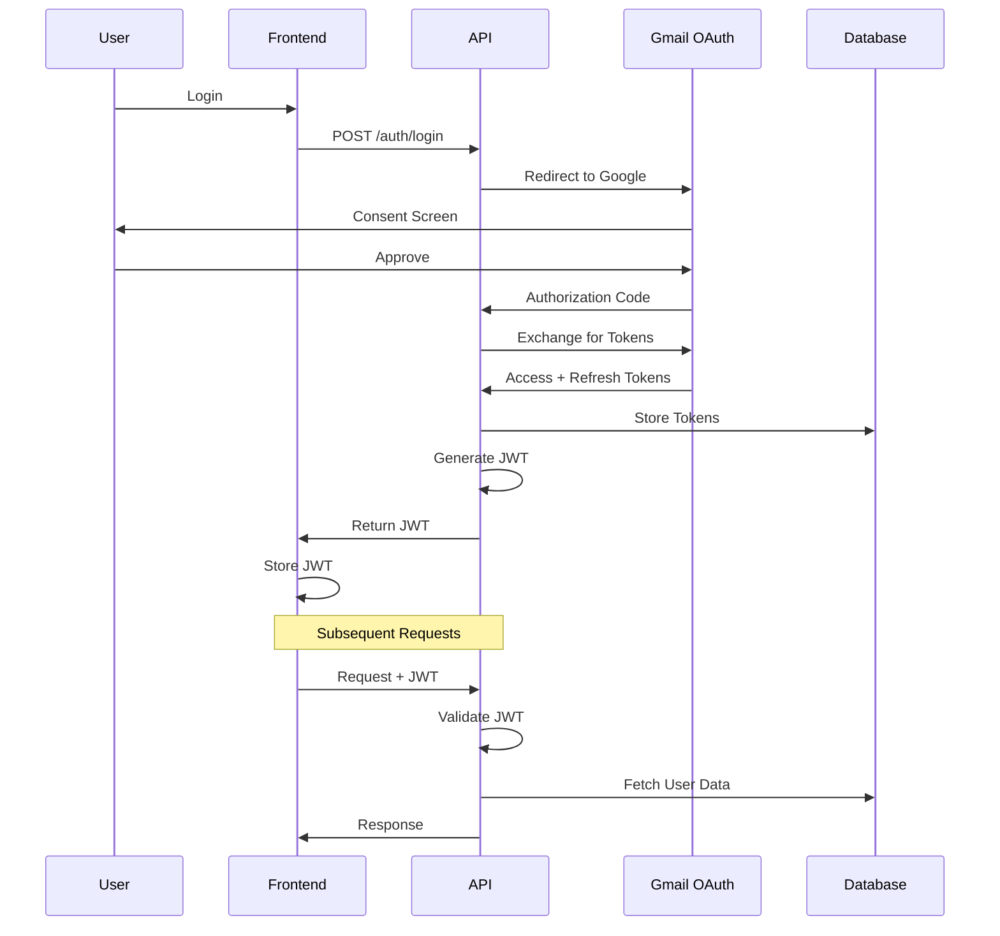

---

## 🚀 Deployment Architecture (Production)

### Cloud Deployment

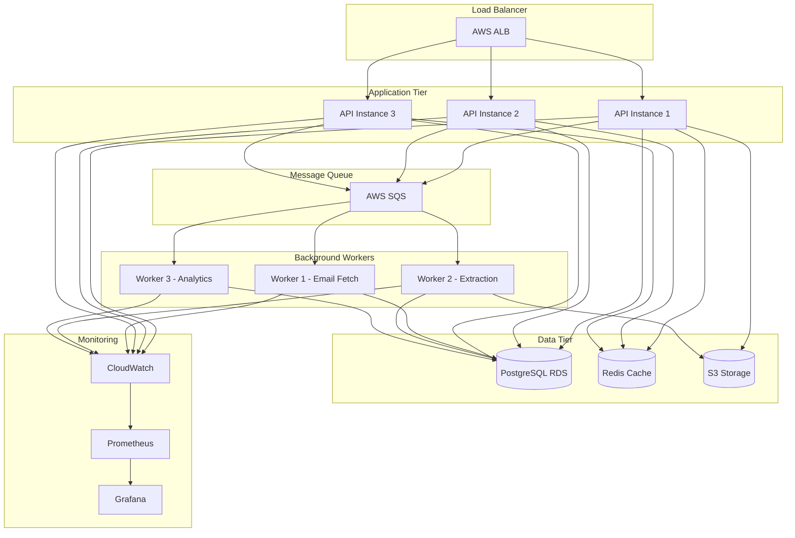

---

## 🧠 LLM Request Lifecycle

### Complete Request Flow

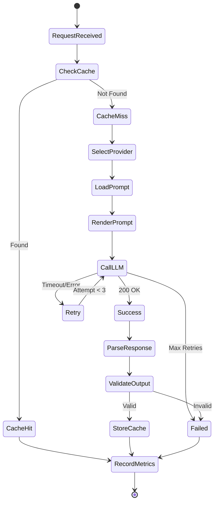

---

## 📈 Scaling Strategy

### Horizontal Scaling

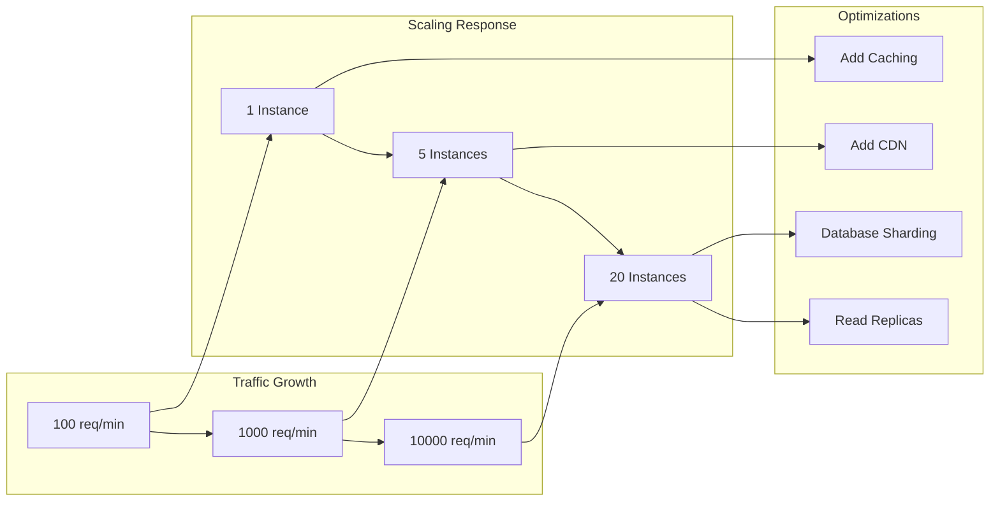

---

## 🎯 Key Architectural Decisions

### Decision Log

| Decision | Rationale | Trade-offs |
|----------|-----------|------------|
| **Multi-Provider LLM** | Flexibility, cost optimization, resilience | Increased complexity |
| **SQLite for Dev** | Simple setup, no external dependencies | Not suitable for production scale |
| **LRU + TTL Cache** | Balance freshness and hit rate | Memory usage |
| **YAML Prompts** | Version control, easy updates | Extra file I/O |
| **JSON Lines Metrics** | Simple, append-only, easy to parse | No built-in aggregation |
| **Typer CLI** | Type-safe, auto-generated help | Learning curve |
| **FastAPI** | Modern, async, auto-docs | Python 3.7+ required |
| **Pydantic Config** | Type validation, IDE support | Verbose for simple configs |

---

## 🔄 Extension Points

### Where to Add New Features

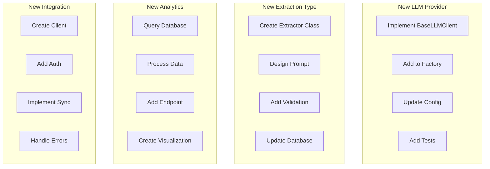

---

## 📚 Learning Path Through Architecture

### Recommended Study Order

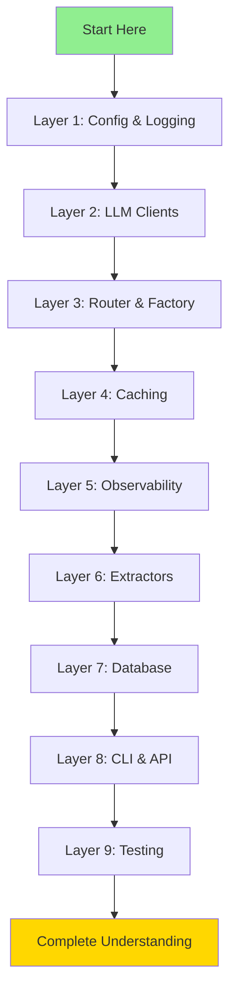

---

## 🎓 Concept Difficulty Levels

### Learning Progression

| Concept | Difficulty | Prerequisites | Time to Learn |
|---------|-----------|---------------|---------------|
| Configuration Management | ⭐ Beginner | Python basics | 1-2 hours |
| Logging | ⭐ Beginner | Python basics | 1-2 hours |
| LLM Client Interface | ⭐⭐ Intermediate | OOP, APIs | 3-4 hours |
| Factory Pattern | ⭐⭐ Intermediate | Design patterns | 2-3 hours |
| Strategy Pattern | ⭐⭐ Intermediate | Design patterns | 2-3 hours |
| Caching (LRU + TTL) | ⭐⭐⭐ Advanced | Data structures | 4-5 hours |
| Observability | ⭐⭐⭐ Advanced | Metrics, monitoring | 5-6 hours |
| Prompt Engineering | ⭐⭐ Intermediate | LLM basics | 3-4 hours |
| Database Design | ⭐⭐ Intermediate | SQL, ORMs | 3-4 hours |
| Testing | ⭐⭐ Intermediate | Pytest, mocking | 4-5 hours |
| API Design | ⭐⭐⭐ Advanced | REST, FastAPI | 5-6 hours |
| Production Deployment | ⭐⭐⭐⭐ Expert | DevOps, cloud | 10+ hours |

---

## 🚀 Next Steps

1. **Study the diagrams** - Understand how components interact
2. **Trace a request** - Follow a transaction extraction end-to-end
3. **Identify patterns** - Recognize design patterns in the code
4. **Map concepts** - Connect diagrams to actual code files
5. **Extend the system** - Add new features using the extension points

---

**Pro Tip:** Print these diagrams and keep them as reference while coding. Understanding the architecture visually makes implementation much easier!
