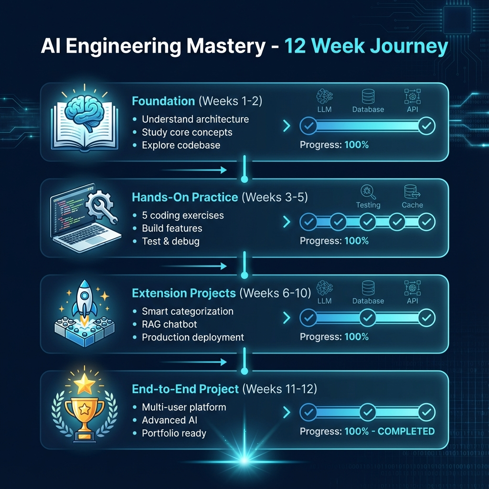
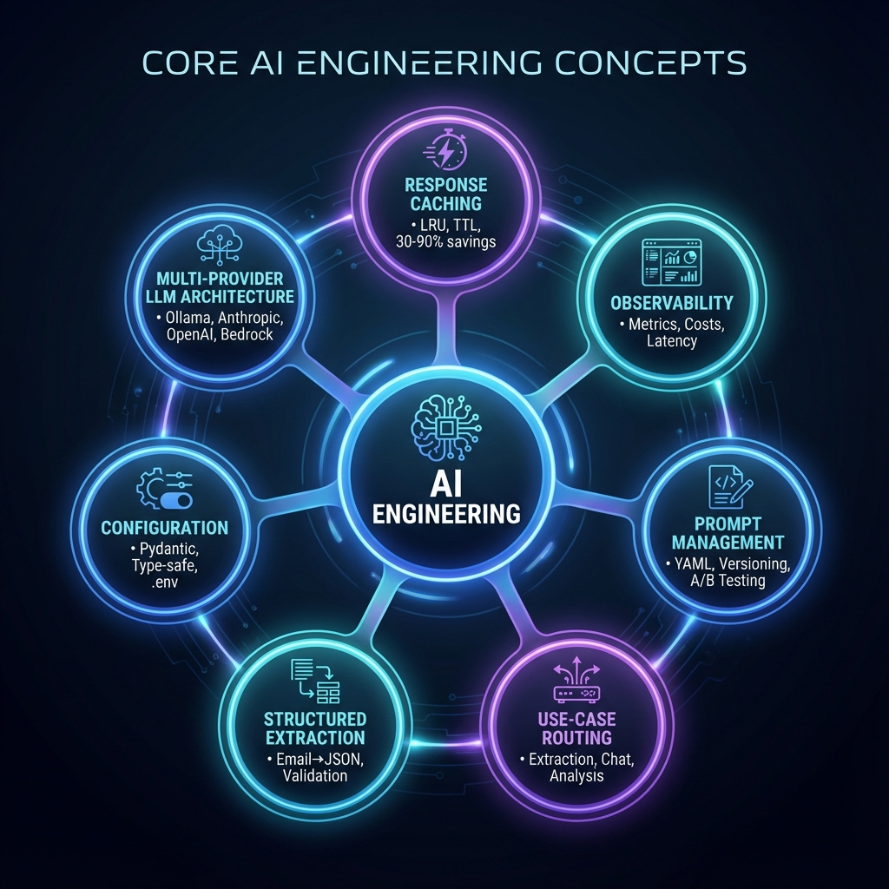

# AI Engineering Learning Guide - Master Index

Your complete guide to understanding and extending the gmail-cli-expense-agent project for AI engineering mastery.

---

## 🎯 Visual Learning Path

---

## 📚 Learning Resources Overview

I've created **4 comprehensive guides** to help you master AI engineering concepts:

### 1. [AI Engineering Learning Guide](AI_CONCEPTS_GUIDE.md)
**Purpose:** Conceptual understanding and career guidance

**Contents:**
- 🧠 **Core AI Engineering Concepts** - Deep dive into 7 key concepts
- 🏗️ **Architecture Deep Dive** - Layered architecture and design patterns
- 📚 **12-Week Learning Path** - Structured progression from basics to advanced
- 🚀 **6 Extension Ideas** - Practical projects to build
- 🎯 **End-to-End Project** - Transform CLI to production SaaS
- 💼 **Career Transition Tips** - Portfolio building and interview prep

**Best for:** Understanding the "why" and "what" of AI engineering

---

### 2. [Hands-On Exercises](HANDS_ON_EXERCISES.md)
**Purpose:** Practical implementation skills

**Contents:**
- 📝 **5 Progressive Exercises** with complete code:
  1. Add New LLM Provider (Gemini)
  2. Implement Cache Analytics
  3. Build Prompt A/B Testing Framework
  4. Add Spending Predictions (ML)
  5. Production Monitoring (Prometheus)

**Best for:** Learning by doing - each exercise builds real features

---

### 3. [Visual Architecture Guide](ARCHITECTURE_DIAGRAMS.md)
**Purpose:** Visual understanding of system design

**Contents:**
- 🏗️ **System Architecture Diagrams** - High-level and detailed views
- 🔄 **Data Flow Diagrams** - Request lifecycle and interactions
- 🧩 **Component Relationships** - Class diagrams and dependencies
- 🎯 **Concept Maps** - Mind maps of AI engineering concepts
- 📊 **Deployment Architecture** - Production setup

**Best for:** Visual learners who need to see how everything connects

---

### 4. [Quick Reference](QUICK_REFERENCE.md)
**Purpose:** Day-to-day coding reference

**Contents:**
- ⚡ **Common Code Patterns** - Copy-paste ready snippets
- 🎨 **Design Pattern Implementations** - Real examples from codebase
- 🐛 **Common Pitfalls & Solutions** - Avoid mistakes
- 🧪 **Testing Patterns** - How to test AI components
- 📊 **Monitoring & Debugging** - Troubleshooting guide
- 📝 **Prompt Engineering Tips** - Write better prompts

**Best for:** Quick lookup while coding

---

## 🎯 Recommended Learning Path

### Phase 1: Foundation (Week 1-2)
**Goal:** Understand current implementation

1. **Read** [AI Engineering Learning Guide](AI_CONCEPTS_GUIDE.md) - Core Concepts section
2. **Study** [Visual Architecture Guide](ARCHITECTURE_DIAGRAMS.md) - All diagrams
3. **Explore** your codebase with new understanding:
   - [`fincli/clients/`](file:///Users/rishavsaraf/Desktop/touch/Development/AI_Agents/gmail-cli-expense-agent/fincli/clients/) - LLM abstraction
   - [`fincli/cache/`](file:///Users/rishavsaraf/Desktop/touch/Development/AI_Agents/gmail-cli-expense-agent/fincli/cache/) - Caching system
   - [`fincli/observability/`](file:///Users/rishavsaraf/Desktop/touch/Development/AI_Agents/gmail-cli-expense-agent/fincli/observability/) - Metrics tracking

**Checkpoint:** Can you explain how a transaction extraction request flows through the system?

---

### Phase 2: Hands-On Practice (Week 3-5)
**Goal:** Build new features

1. **Complete** [Hands-On Exercises](HANDS_ON_EXERCISES.md) in order:
   - Exercise 1: Add Gemini provider (2-3 hours)
   - Exercise 2: Cache analytics (1-2 hours)
   - Exercise 3: A/B testing (3-4 hours)
   - Exercise 4: ML predictions (4-5 hours)
   - Exercise 5: Monitoring (5-6 hours)

2. **Use** [Quick Reference](QUICK_REFERENCE.md) for code patterns

**Checkpoint:** Have you successfully added at least 3 new features?

---

### Phase 3: Extension Projects (Week 6-10)
**Goal:** Build substantial features

Choose 2-3 extensions from [AI Engineering Learning Guide](AI_CONCEPTS_GUIDE.md):

**Recommended:**
1. **Smart Categorization** (Week 6-7)
   - Automatic transaction categorization
   - Category-based analytics
   - Budget tracking by category

2. **Conversational Interface with RAG** (Week 8-9)
   - Vector embeddings
   - Semantic search
   - Context-aware responses

3. **Production Deployment** (Week 10)
   - Docker containerization
   - CI/CD pipeline
   - Cloud deployment

**Checkpoint:** Do you have a portfolio-worthy project?

---

### Phase 4: End-to-End Project (Week 11-12)
**Goal:** Production-ready application

Follow the [End-to-End Project Guide](AI_CONCEPTS_GUIDE.md#end-to-end-ai-engineering-project):

1. Multi-user support
2. Advanced AI features
3. Production deployment
4. Documentation

**Checkpoint:** Can you demo this to potential employers?

---

## 📊 Your Project Assessment

### Current Strengths ✅

Your project already demonstrates:

1. **Production-Ready Code**
   - ✅ 106/106 tests passing
   - ✅ Type hints throughout
   - ✅ Comprehensive error handling
   - ✅ Structured logging

2. **AI Engineering Best Practices**
   - ✅ Multi-provider LLM support
   - ✅ Response caching (30-90% cost reduction)
   - ✅ Observability & metrics tracking
   - ✅ Prompt versioning

3. **Clean Architecture**
   - ✅ Layered design
   - ✅ Design patterns (Factory, Strategy, Singleton)
   - ✅ Separation of concerns
   - ✅ Dependency injection

4. **Developer Experience**
   - ✅ CLI with Typer
   - ✅ REST API with FastAPI
   - ✅ Comprehensive documentation
   - ✅ Example scripts

### Areas for Growth 🚀

To become a complete AI engineering project:

1. **Advanced AI Features**
   - ⚪ RAG for conversational queries
   - ⚪ Vector embeddings for semantic search
   - ⚪ ML-based predictions
   - ⚪ Anomaly detection

2. **Production Engineering**
   - ⚪ Docker deployment
   - ⚪ CI/CD pipeline
   - ⚪ Monitoring dashboards (Grafana)
   - ⚪ Load testing

3. **Scalability**
   - ⚪ Async processing
   - ⚪ Job queues (Celery/RQ)
   - ⚪ Database optimization
   - ⚪ Horizontal scaling

4. **User Features**
   - ⚪ Multi-user support
   - ⚪ Authentication & authorization
   - ⚪ Web dashboard
   - ⚪ Mobile app

---

## 🎓 Key Concepts You'll Master

### AI Engineering Concepts

| Concept | Current Level | Target Level | Learning Resource |
|---------|--------------|--------------|-------------------|
| **LLM Integration** | ✅ Advanced | Expert | [Hands-On Ex. 1](HANDS_ON_EXERCISES.md#exercise-1) |
| **Prompt Engineering** | ✅ Intermediate | Advanced | [Quick Ref - Prompts](QUICK_REFERENCE.md#prompt-engineering-tips) |
| **Caching Strategies** | ✅ Advanced | Expert | [Hands-On Ex. 2](HANDS_ON_EXERCISES.md#exercise-2) |
| **Observability** | ✅ Intermediate | Advanced | [Hands-On Ex. 5](HANDS_ON_EXERCISES.md#exercise-5) |
| **RAG** | ⚪ Beginner | Intermediate | [Learning Guide - Ext. 6](AI_CONCEPTS_GUIDE.md#extension-6) |
| **Vector Embeddings** | ⚪ Beginner | Intermediate | [Learning Guide - Ext. 6](AI_CONCEPTS_GUIDE.md#extension-6) |
| **ML Integration** | ⚪ Beginner | Intermediate | [Hands-On Ex. 4](HANDS_ON_EXERCISES.md#exercise-4) |
| **A/B Testing** | ⚪ Beginner | Intermediate | [Hands-On Ex. 3](HANDS_ON_EXERCISES.md#exercise-3) |

### Software Engineering Concepts

| Concept | Current Level | Target Level | Learning Resource |
|---------|--------------|--------------|-------------------|
| **Design Patterns** | ✅ Advanced | Expert | [Visual Guide - Patterns](ARCHITECTURE_DIAGRAMS.md#design-patterns-used) |
| **Testing** | ✅ Advanced | Expert | [Quick Ref - Testing](QUICK_REFERENCE.md#testing-patterns) |
| **API Design** | ✅ Intermediate | Advanced | [Learning Guide - Phase 3](AI_CONCEPTS_GUIDE.md#phase-3) |
| **Database Design** | ✅ Intermediate | Advanced | [Visual Guide - Schema](ARCHITECTURE_DIAGRAMS.md#database-schema) |
| **Docker** | ⚪ Beginner | Intermediate | [Learning Guide - Deployment](AI_CONCEPTS_GUIDE.md#production-feature-1) |
| **CI/CD** | ⚪ Beginner | Intermediate | [Learning Guide - Deployment](AI_CONCEPTS_GUIDE.md#production-feature-1) |

---

## 🚀 Next Steps - Action Plan

### This Week

- [ ] Read all 4 learning guides (2-3 hours)
- [ ] Study the visual architecture diagrams (1 hour)
- [ ] Trace one transaction extraction request through the code (1 hour)
- [ ] Set up a learning schedule for next 12 weeks

### Next Week

- [ ] Complete Exercise 1: Add Gemini provider
- [ ] Write a blog post about what you learned
- [ ] Share your progress on LinkedIn/Twitter

### This Month

- [ ] Complete all 5 hands-on exercises
- [ ] Choose 2 extension projects to build
- [ ] Start building your portfolio website
- [ ] Join AI engineering communities

### Next 3 Months

- [ ] Complete end-to-end project
- [ ] Deploy to production
- [ ] Write 5+ technical blog posts
- [ ] Contribute to open source
- [ ] Start applying for AI engineering roles

---

## 💡 Tips for Success

### 1. Learn by Building
Don't just read - implement! Each concept becomes clear when you code it yourself.

### 2. Document Everything
Write blog posts, create diagrams, explain concepts to others. Teaching is the best way to learn.

### 3. Build in Public
Share your progress on social media. It creates accountability and networking opportunities.

### 4. Focus on Fundamentals
Master the basics before moving to advanced topics. Solid foundations matter.

### 5. Join Communities
- Discord: AI engineering servers
- Twitter: Follow AI engineers
- GitHub: Star and contribute to projects
- LinkedIn: Connect with professionals

### 6. Create a Portfolio
Your project is already impressive. Document it well, deploy it, and showcase it.

---

## 📈 Measuring Progress

### Weekly Check-ins

Ask yourself:
- What did I learn this week?
- What did I build?
- What challenges did I face?
- What will I do differently next week?

### Monthly Milestones

Track:
- Features implemented
- Blog posts written
- Tests added
- Documentation updated
- Community contributions

### Quarterly Goals

Achieve:
- Complete project deployed
- Portfolio website live
- 5+ blog posts published
- 2+ open source contributions
- Job applications sent

---

## 🎯 Career Transition Checklist

### Portfolio

- [ ] GitHub profile polished
- [ ] README files comprehensive
- [ ] Project deployed and live
- [ ] Architecture documented
- [ ] Demo video created

### Content

- [ ] 5+ technical blog posts
- [ ] Active on Twitter/LinkedIn
- [ ] Presentations at meetups
- [ ] YouTube tutorials (optional)

### Skills

- [ ] LLM integration mastered
- [ ] Prompt engineering proficient
- [ ] Production deployment experience
- [ ] Testing expertise
- [ ] System design knowledge

### Network

- [ ] 50+ AI engineer connections
- [ ] Active in communities
- [ ] Attended meetups/conferences
- [ ] Contributed to open source

### Applications

- [ ] Resume updated
- [ ] Cover letter template
- [ ] Interview prep done
- [ ] 10+ applications sent

---

## 📚 Additional Resources

### Books
- "Designing Data-Intensive Applications" - Martin Kleppmann
- "Building LLM Apps" - Valentina Alto
- "The Pragmatic Programmer" - Hunt & Thomas

### Courses
- [Full Stack Deep Learning](https://fullstackdeeplearning.com/)
- [Fast.ai](https://www.fast.ai/)
- [DeepLearning.AI](https://www.deeplearning.ai/)

### Communities
- [r/MachineLearning](https://reddit.com/r/MachineLearning)
- [r/LocalLLaMA](https://reddit.com/r/LocalLLaMA)
- AI Engineering Discord servers

### Blogs
- [Anthropic Blog](https://www.anthropic.com/news)
- [OpenAI Blog](https://openai.com/blog)
- [Hugging Face Blog](https://huggingface.co/blog)

---

## 🎉 Conclusion

You've built an impressive AI engineering project! Now it's time to:

1. **Understand** what you've built (use these guides)
2. **Extend** it with new features (hands-on exercises)
3. **Deploy** it to production (end-to-end project)
4. **Showcase** it to employers (portfolio)

**You're already ahead of most people learning AI engineering.** Your project demonstrates production-ready code, best practices, and real-world problem-solving.

The path from here to AI engineering role is clear:
- Master the concepts in your project
- Build the extensions
- Document and share your work
- Network and apply

**You've got this! 🚀**

---

## 📞 Questions?

As you work through these materials, keep notes of:
- Concepts you don't understand
- Features you want to add
- Problems you encounter
- Ideas for improvements

These will guide your learning journey and make great blog post topics!

---

**Remember:** The goal isn't to learn everything at once. It's to build a strong foundation, create impressive projects, and demonstrate your skills to potential employers.

Start with Phase 1, work through the exercises, and build something amazing!

Good luck on your AI engineering journey! 🌟
